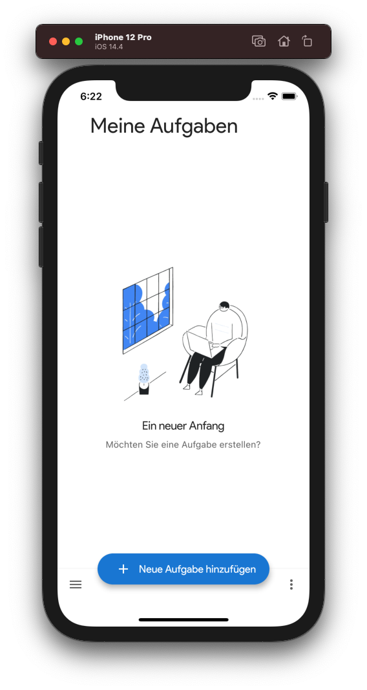
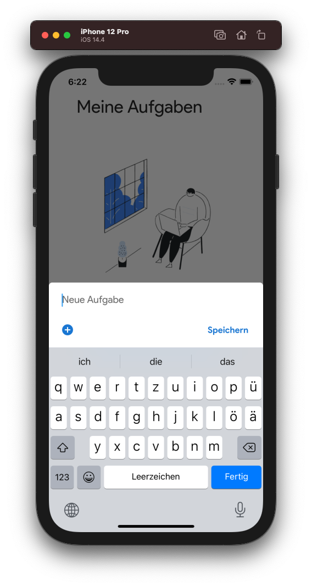
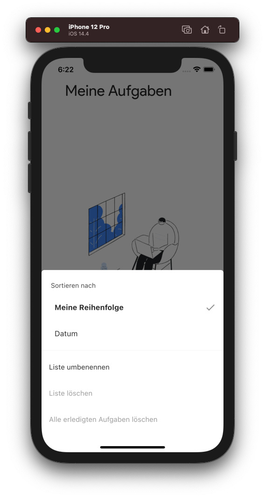
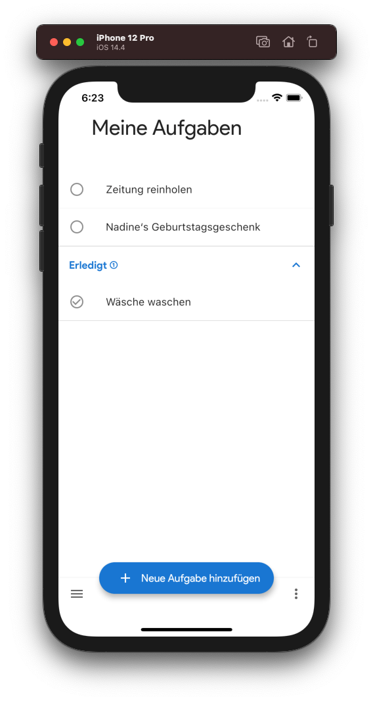

<h1 align="center">Flutter Tasks</h1>

    <strong>A rough clone of the Google Tasks app with Flutter.</strong>

 
    
    

    <a href="#-screenshots"><b>Screenshots</b></a>
      •  
    <a href="#-development"><b>Development</b></a>
      •  
    <a href="#-contribute"><b>Contribute</b></a>  

---

This Flutter app is a rough clone of an earlier version of the Google Tasks
application.

And I know it all lives in one file that is way too long, but this is just a
demo.

 

## ❯ Screenshots

    
    
    
    

 

## ❯ Development

1. **Install the Flutter SDK**

    This project is built with Flutter 2. You need the Flutter SDK installed
    locally to start the project, which you can get
    [here](https://flutter.dev/docs/get-started/install).

2. **Install Flutter packages**

    Run `flutter pub get` to install all neccesary packages.

3. **Run the application**

    You can start the application with the
    [Flutter extension](https://flutter.dev/docs/get-started/editor) for the
    editor of your choice.

    If you like it old-school, you can also use the `flutter run` command.

 

## ❯ Contribute

If you think you have any ideas that could benefit the project, feel free to
create a pull request!

 

---

    
        Project by Leo Driesch, released under <a href="https://github.com/leodr/flutter_tasks/blob/main/LICENSE">MIT license</a>.
    

    
    &nbsp;&nbsp;
    

